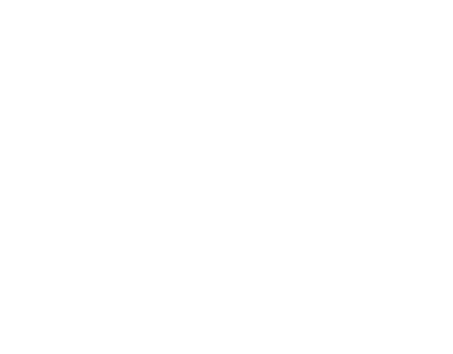
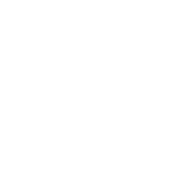
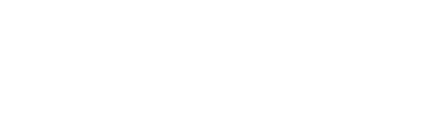
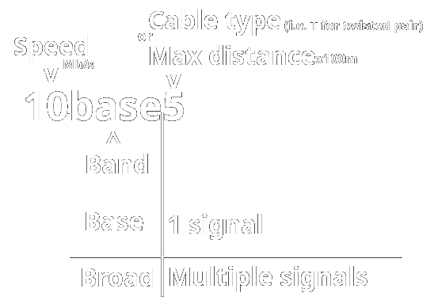

# ENT Study Guide for TTC ENT 2026

## OSI Model
OSI Model stands for Open Systems Interconnection Model. It has 7 layers, normally referenced from 7 down to 1:  
​7. [Application](#application-layer)  
​6. [Presentation](#presentation-layer)  
​5. [Session](#session-layer)  
​4. [Transport](#transport-layer)  
​3. [Network](#network-layer)  
​2. [Data-Link](#data-link-layer)  
​1. [Physical](#physical-layer)  

### Physical Layer
This layer is what happens physically - it's where raw bits of information are sent across a physical medium like a 
copper/fiber wire or a radio signal. This happens on cables, antennas, and hubs; remember that those are layer 1 devices.

### Data-Link Layer
This layer handles communication between devices over a local network and connects the physical layer to the 
Network layer. Switches typically operate at this layer. This layer has 2 parts:
- LLC: Logical Link Control - More on this later.
- MAC - Media Access Control - Handles Layer 2 addressing using MAC addresses, AKA physical addresses; involves NIC cards, NIC drivers, and switches. NIC stands for Network Interface Card.

Switches primarily perform switching at this layer. Remember that switches are layer 2 devices.

### Network Layer
This layer deals with routing and logical addresses. Involves routers and IP addresses (IPV4/IPV6). Routers perform 
routing in this layer. Remember that routers are layer 3 devices.

### Transport Layer
This layer provides reliable end-to-end flow control and error correction/detection. It manages communication between applications
running on different devices using TCP/UDP protocols. TCP provides reliable, ordered delivery, while UDP provides faster 
connectionless communication without TCP's reliability guarantees.

### Session Layer
Manages (starts, stops, maintains) connections.

### Presentation Layer
This layer handles translation and encryption of the data.

### Application Layer
Provides network services directly to applications. This is the layer closest to the end user.

## Networking Tools
The following are the main tools used in networking:
- Cable Stripper
  - Strips the outer plastic of a cable
- Wire Crimper
  - Crimps ends of twisted pair cables
- Cable Tester
  - Tests netowrk cables by testing continuity across every pin on both ends
- Tone Generator
  - Finds the other end of a cable by generating a tone when near the other end of the cable plugged into it.
- TDR (Time Domain Reflectometer)
  - Finds breaks in copper cables by sending electrical pluses and measuring how far they go
- OTDR (Optical Time Domain Reflectometer)
  - Finds breaks in fiber optic cables by sending light pulses and measuring how far they go
- Light Meter
  - Measures light in optical cables. Requires a light source device on one end. Fiber optic cables only.
- Loopback Adapter
  - Tests physical ports
- Butt Set
  - Used to test and monitor phone lines
- Punch Down Tool 
  - Seats wires down into a block and cuts off excess wire automatically
- Multimeter
  - Measures electricity in a wire

## Modems VS Routers

### Modems
Modems are devices that provide the **physical connection** to the ISP (Internet Service Provider). They demodulate
incoming analog signals into digital singals and modulate outgoing digital signals into analog signals.

There are 2 types of modems:
- Cable Modems - Use coaxial cables
- DSL Modems - Use phone lines

You can remember the difference this way: *Cable* modems use ***cables*** and DSL (Digital Subscriber _Line_) modems use 
**phone *lines***.

### Routers
Routers are devices that provide the **logical connection** to the ISP and connect all your devices on the network to 
the ISP.

## EIA/TIA 568B Standard Specification
The EIA/TIA 568B standard specifies the order of wires in a CAT5/CAT6 cable connector. This order is, from top to 
bottom, pins 1 to 8:

| Wire Color          | Mnemonic       |
|---------------------|----------------|
| Orange/white stripe | Sun rays       |
| Orange              | Sun            |
| Green/white stripe  | Aliens!!       |
| Blue                | Sky            |
| Blue/white stripe   | Water/rain     |
| Green               | Plants         |
| Brown/white         | Tilled dirt    |
| Brown               | Dirt           |

It should be noted that while we memorize it bottom to top, the top is pin 1 and bottom is pin 8.

## Physical Layer in depth - Bits, Nibbles, and Bytes

### Bits
Abbreviated as lowercase `b`, bits are a single 1 or 0 - on or off. Bits are what make up binary code. Data throughput,
or more simply but less accurately put, data speed, is measured in bits per second (or kilobits, megabits, etc.).
1,000 bits make up a kilobit (Kb).
1,000 kilobits make up a megabit (Mb).
After that is gigabits (Gb), then terrabits (Tb), petabits (Pb), exabits (Eb), and so on.

### Nibbles
Nibbles are made of 4 bits. There isn't a standard abbreviation for nibbles, but you may sometimes see "nib," "nybble", 
or "N" used informally. You won't normally see anything like kN or kilonibble ever used, and there's no standard for 
this.

### Bytes
Bytes are made of 8 bits or 2 nibbles. Abbreviated as uppercase `B`, bytes are what data storage is measured in.
1,024 bytes make a kilobyte (KB). 
1,024 kilobytes make a megabyte (MB).
After that is gigabytes (GB), then terabytes (TB), petabytes (PB), exabytes (EB), etc.

> **Fun Fact**:
> There's also kibibytes (KiB), mebibytes (MiB), etc. It is actually a common misconception (and often accepted as true, including in this class) that KB, MB, etc. are 1,024, but in reality they are actually 1,000, while KiB, MiB, etc. are 1,024. However, these distinctions are rarely used in everyday networking, and we don't care about them in this class. Therefore, for this class, you should ignore this fact and treat the above info as true instead.

> **Another Fun Fact**:
> A lowercase `k` for 'kilo' is technically more correct in "kb" and "kB" instead of "Kb" and "KB", but it doesn't matter much. This only applies to 'kilo.'

### Counting Bits / Calculating Binary

**IMPORTANT:** MEMORIZE THIS TABLE:

| 128 | 64 | 32 | 16 | 8 | 4 | 2 | 1 |
|-----|----|----|----|---|---|---|---|

To calculate the value of a binary number, place the sequence of 1's and 0's at the right end of the table like so:

| 128 | 64 | 32 | 16 | 8 | 4 | 2 | 1 |
|-----|----|----|----|---|---|---|---|
| 0   | 0  | 1  | 0  | 0 | 1 | 0 | 1 |

In this example, 00000101 is placed in the table. Start at the right side; for each 1 in the binary, add
the number at the top of the table in that digit's column to the total. In this example, that would be adding 1, 4, and 
32, which means 00100101 in binary has a value of 37. This also works for shorter binary sequences, like 1001:

| 128 | 64 | 32 | 16 | 8 | 4 | 2 | 1 |
|-----|----|----|----|---|---|---|---|
|     |    |    |    | 1 | 0 | 0 | 1 |

1 + 8 = 9, so 1001 = 9.

Despite only having 2 on bits, this is still a 4-bit number. The number of bits don't change based on how many 1's there
are, only the value of the binary number does.

This table can also be expanded indefinitely. For every column you add to the left, you double the previous number, so
to have a 9-bit binary number, we would add 256 to the left of 128.

#### Calculation Tricks

What's the value of these 3 binary numbers?
- `0001`
- `0011`
- `0111`

You don't have to keep adding 4 + 2 + 1 here. If there's a line of solid 1's on the right side and all zeros elsewhere,
the value will always be 1 less than the next digit. For example, `0111` is going to be 1 less than `1000`. Because of
this, not only can you more quickly calculate these types of binary numbers, but you also know that if there's no `1`
bits to the left of a certain digit, you know the total will ALWAYS be less than that digit. (for example, the leftmost
`1` being in the 16's place means the total value must be 15 or fewer.) This helps you eliminate wrong answers on a test
faster.

The answer to the 3 numbers above is 1, 3, and 7.

Now apply the inverse; what's the value of these numbers?
- `1000`
- `1100`
- `1110`

If there's a line of solid 1's on the left followed by all zeros, the value will always be 1 less than the next digit,
minus the value of the trailing zeros if they were ones. For example, `11111000` is 1 less than `100000000` (256), minus
8, giving 248. You can also think of it as starting with all 1's (`255` for 8 bits) and subtracting the value of the 
trailing zeros if they were ones: `11111000 = 255 - 7 = 248`.

So the answer to the 3 numbers above is 8, 12, and 14.

Finally, if you have more random looking sequences like 01101001 on a test, you can eliminate the wrong answers quickly
because a binary sequence ending in a 1 will always be an odd number, and ending in a 0 will always be even. For example,
say you have to find which binary sequence equals 27. These are your choices:  
a. `00101110`  
b. `00011011`  
c. `00010110`  
d. `01001010`  

You know B has to be correct just from looking at the last digit because a, c, and d are all even numbers, and 27 is odd. 

## Connection Types

### Simplex
Simplex is a type of connection that only allows **one** direction of communication.   
Example: Radio stations, megaphone

### Half-Duplex
Half-Duplex is a type of connection that allows **both** directions of communication, but **only one at a time**.  
Example: Humans, CB Radio, Walkie talkies, hubs

### Full Duplex
Full Duplex is a type of connection that allows **both** directions of communication **at the same time**.  
Example: Computer networks, switches, phone lines

## Network Topologies
Topology is the layout of the network. There are four main wired network topologies:
- [Star](#star)
- [Ring](#ring)
- [Bus](#bus)
- [Mesh](#mesh)

### Star
In a Star topology, all computers are connected to a central point.  
Here's a couple examples of what a Star layout would look like:  
  


A star topology uses hubs/switches at the center and uses twisted pair cables with RJ45 connectors.

### Ring
A ring topology is where all computers are connected in a ring. THey use a token to talk on the network.  
Here's an example of what a Ring layout would look like:  


### Bus
The bus topology has its computers connected in a line with a single coaxial cable, terminated on both ends. They
use BNC connectors and terminators.  
Here's an example of what a Bus layout would look like:  


A bus topology uses thicknet (10base5) and thinnet (10base2) cables.

### Mesh
A mesh topology is where all the computers are connected to all every other computer. This is the topology of the 
internet, and is extremely redundant (in a good way).  
Here's a couple examples of what a Mesh layout would look like:  


A mesh network can be either wired or wireless.

## Wired Ethernet Standards



### Chart

| IEEE Standard | T-Standard | Max Distance                           | Speed    | Cable Type                    | Connectors                                | notes                                                |
|---------------|------------|----------------------------------------|----------|-------------------------------|-------------------------------------------|------------------------------------------------------|
| 802.3         | 10base2    | 200m                                   | 10 Mb/s  | Thinnet (thin coax)           | T-connectors, BNC connectors, terminators |                                                      |
| 802.3         | 10base5    | 500m                                   | 10 Mb/s  | Thicknet (thick coax)         | Vampire Taps                              |                                                      |
| 802.3i        | 10baseT    | 100m                                   | 10 Mb/s  | Twisted pair, Cat3 or better  | RJ45/RJ11                                 | cheaper, started being called ethernet at this point |
| 802.3u        | 100baseT   | 100m                                   | 100 Mb/s | Twisted pair, Cat5 or better  | RJ45                                      |                                                      |
| 802.3z        | 1000baseT  | 100m                                   | 1 Gb/s   | Twisted pair, Cat5e or better | RJ45                                      | also called Gigabit ethernet                         |
| 802.3an       | 10GbaseT   | Cat5e/Cat6: 55m; Cat6a or better: 100m | 10 Gb/s  | Twisted pair                  | RJ45                                      |                                                      |

## Patch Cables VS Crossover Cables

### Patch Cables
Also known as straight cables, these are ethernet cables that follow the same 568A or 568B standard on both terminated 
ends. They are used to connect two dissimilar devices, such as a PC and a router, router and switch, etc.

### Crossover Cables
These are ethernet cables that use both standards - 568A on one end and 568B on the other. These less common cables
are used to connect 2 similar devices, such as a PC to another PC.

Modern Ethernet equipment usually supports Auto-MDI/MDIX, which automatically detects and compensates for crossed pairs.
As a result, crossover cables are much less commonly needed today.

**Important miscellanous note**: Shielded twisted pair cables should be used in industrial areas, while unshielded
twisted pair cables belong everywhere else. The difference between the two is that shielded twisted pair cables have 
another layer of shielding around the twisted pair wires underneath the outer jacket plastic.

## Cable Ratings

PVC is the outer jacket plastic of a cable. 

Ethernet cable materials come in 3 forms:
- Plenum
- Riser
- CM (communications multipurpose)

### Plenum (CMP) Cables
These are used in plenum areas. Plenum areas are the spaces in buildings used for air circulation in HVAC systems, 
typically found above drop ceilings or below raised floors, where smoke and fire can spread rapidly through the building's 
air-handling space. Plenum-rated cables are made with fire-resistant materials that produce less smoke and toxic fumes 
when burned, meeting strict fire safety codes required for installation in plenum areas. Plenum cables are also known
as CMP: Communications Multipurpose Plenum. 

Non-plenum cables are not as fire-resistant and should not be used in plenum areas.

### Riser (CMR) Cables

Riser cables are designed to run vertically between floors in non-plenum spaces, such as within walls or elevator
shafts. These cables are specifically rated to prevent the vertical spread of fire from one floor to another. They have
flame-retardant properties that are less stringent than plenum cables but more robust than standard CM cables, making
them ideal for multi-story buildings where cables need to traverse between floors. Riser cables must meet certain fire
safety standards. You can remember that CMR is called "riser" because CMR cables run vertically up and between floors.

### CM (general use) Cables
Communications Multipurpose (or CM) cables have minimal fire restrictions and are the cheapest cables, but can produce
very toxic fumes when burnt. They are designed for general everyday use.

## ESD, EMI, & EMP

### ESD
ESD stands for electrostatic discharge. ESD is essentially a static electricity zap and can be destructive to electronics.

### EMI
EMI stands for electromagnetic interference. EMIs are (sometimes) temporary disturbances that may take out or interfere 
with your Wi-Fi or disrupt electronics briefly. They can be caused by things like storms, generators, power lines, etc.

### EMP
EMP stands for electromagnetic pulse. These are very destructive. They can be caused by lightning strikes (very small 
area of effect) or nuclear explosions (extremely large area of effect). 

## Wireless 802.11

Wireless uses radio frequencies to transmit without wires. They operate on 2.4 GHz and 5 GHz frequencies. Newer
Wi-Fi standards (like Wi-Fi 7) can also operate on 6 GHz, but those are new enough that you likely won't be tested on them.

### Frequency Band Chart

| Frequency Band | Total Channels | Non-Overlapping Channels  | Speed  | Distance & Penetration                 | Interference Level |
|----------------|----------------|---------------------------|--------|----------------------------------------|--------------------|
| 2.4 GHz        | 11 Total       | 3 (Channels 1, 6, and 11) | Slower | Farther; penetrates walls easily       | High               |
| 5 GHz          | 25 Total       | All 25                    | Faster | Shorter; cannot penetrate walls easily | Low                |

### 2.4 GHz

* Has 11 channels total, but only 3 don't overlap.
* Channels 1, 6, and 11 do not overlap.
* Slower than 5 GHz 
* Goes farther than 5GHz and can more easily penetrate solid objects like walls.
* More interference than 5GHz due to many other devices operating on this frequency, such as microwaves, Bluetooth 
headphones, or cordless telephones.

### 5 GHz

* Has 25 **non-overlapping** channels.
* Generally faster than 2.4GHz
* Goes a shorter distance than 2.4GHz and can't easily penetrate solid objects.
* Less interference than 2.4GHz due to fewer devices operating on this frequency.

### Security
Wi-Fi networks can operate with different types of security:

* ⚠ **Open**
  * No password = no security.
  * Hackers can steal your data
  * Some open networks can be malicious honeypots
  * **Do not connect!**

* ⚠ **WEP - Wired Equivalent Privacy**
  * Easily hackable 
  * Not secure.

* ⚠ **WPA - Wi-Fi Protected Access**
  * Uses TKIP keys = not secure (anymore)
  * Easily hackable

* ✓ **WPA2**
  * Uses AES.
  * Used by the US Department of Defense.
  * Secure (for now).

* ✓ **WPA3**
  * New and cutting edge (2018).
  * Secure (for now).

* ⚠ **WPS**
  * Easy to set up
  * Very insecure

## Wireless Wi-Fi Standards

Speeds and distances shown are advertised speed and distances under perfect lab conditions.

### Chart

| Version | IEEE Standard | Frequency       | Speed    | Distance |
|---------|---------------|-----------------|----------|----------|
| Wi-Fi   | 802.11        | 2.4 GHz         | 2 Mb/s   | 100 ft   |
| Wi-Fi 1 | 802.11b       | 2.4 GHz         | 11 Mb/s  | 100 ft   |
| Wi-Fi 2 | 802.11a       | 5 GHz           | 54 Mb/s  | 100 ft   |
| Wi-Fi 3 | 802.11g       | 2.4 GHz         | 54 Mb/s  | 125 ft   |
| Wi-Fi 4 | 802.11n       | 2.4 GHz + 5 GHz | 600 Mb/s | 225 ft   |
| Wi-Fi 5 | 802.11ac      | 5 GHz           | 1 Gb/s   | 90 ft    |
| Wi-Fi 6 | 802.11ax      | 2.4 GHz + 5 GHz | 14 Gb/s  | 100 ft   |

Wi-Fi 7 will likely not be tested on but is under 802.11be, operates on 2.4 GHz, 5 GHz, AND 6 GHz, 
and can reach up to 46 Gb/s. Wi-Fi 8 will not eb tested on either as it is not planned to release 
until 2028; Wi-Fi 8 is under 802.11bn.

## Wired VS Wireless

### Wired
- Reliable
- Secure
- Not mobile

Contention Method (traffic control): CSMA/CD (Carrier Sense Multiple Access with Collision _Detection_)

### Wireless
- Unreliable
- Less secure
- Mobile

Contention method: CSMA/CA (Carrier Sense Multiple Access with Collision _Avoidance_)

## WAN Technologies

### Modems and POTS

Traditional dial-up modems used POTS lines (Plain Old Telephone Service lines), which provided analog telephone 
connections over copper wires. A modem converted digital computer data into signals suitable for transmission over 
the analog telephone line and converted received signals back into digital data. Dial-up modem speeds ranged from 
approximately 300 bps to 54 Kbps, depending on the modem and connection standard.

### Carrier chart

| Carrier | 64 Kbps Channels | Max Throughput |
|---------|-----------------:|---------------:|
| ISDN    |                2 |   128 **K**bps |
| T1      |               24 |     1.544 Mbps |
| T3      |      672 (T1x28) |    44.736 Mbps |
| E1      |               32 |     2.048 Mbps |
| E3      |      512 (E1x16) |    34.368 Mbps |

T1 and T3 are what were used in North America, while E1 and E3 were mostly used in Europe.

## Data-Link Layer

The Data-Link Layer (Layer 2) is responsible for communication between devices over a local network. In IEEE 802 
networks, the Data-Link Layer is divided into two sublayers:

- LLC (Logical Link Control)
- MAC (Media Access Control)

### Logical Link Control (LLC)

**LLC (Logical Link Control)** is the upper sublayer of the Data-Link Layer. It provides an interface between the 
Network Layer and the MAC sublayer and helps identify and provide services for the protocols operating above the 
Data-Link Layer. LLC binds logical addresses to physical cards. LLC is defined by IEEE 802.2.

Think of LLC as the logical side of Layer 2: it connects higher-layer protocols to the Data-Link Layer.

### Media Access Control (MAC)

**MAC (Media Access Control)** is the lower sublayer of the Data-Link Layer. It sits between the LLC sublayer and the 
Physical Layer and handles functions related to accessing the transmission medium and MAC addressing.

Two common IEEE 802 MAC standards are:

| Standard   | Technology | Medium   |
| ---------- | ---------- | -------- |
| **802.3**  | Ethernet   | Wired    |
| **802.11** | Wi-Fi      | Wireless |

### NICs and MAC Addresses

A **NIC (Network Interface Card)** is the hardware interface that allows a device to connect to a network. NICs implement
functions associated with the Data-Link and Physical Layers and have a MAC address associated with their network interface.

A **MAC address** is a Layer 2 physical address used to identify a network interface for communication on a local 
network. A traditional MAC address is 48 bits (or 6 bytes) and is normally written as six hexadecimal pairs.

Example:  
`03:E5:B1:F4:B2:A4`

MAC addresses are intended to be globally unique identifiers (though, in practice, there can be some duplicates). The
first half (`03:E5:B1` in our example) is the OUI (organizationally unique identifier), which is assigned by the IEEE to
manufacturers and identifies the vendor or organization that produced the network interface. The second half is a unique
sequence that should not be duplicated on any other MAC address with the same OUI.

> **Remember:** A MAC address identifies a **network interface**, not the physical location of the device.

### MAC Address vs. IP Address

A useful way to distinguish the two is:

| Address         | OSI Layer           | Purpose                                                                                                        |
| --------------- |---------------------|----------------------------------------------------------------------------------------------------------------|
| **IP address**  | Layer 3 - Network   | Identifies a device/interface for communication across networks. Provides the device location/how to reach it. |
| **MAC address** | Layer 2 - Data-Link | Identifies a network interface for local network communication. Provides the device identity.                  |

**ARP (Address Resolution Protocol)** is used with IPv4 to determine the MAC address corresponding to an IP address on 
the local network. In other words, **ARP is what resolves the MAC address from the IP address** (not LLC).

### Summary
To summarize, here's a graphic to visualize the Data-Link layer's sublayers:

```text
Data-Link Layer (Layer 2)
│
├── LLC — Logical Link Control
│   └── Interfaces with the Network Layer
│
└── MAC — Media Access Control
    ├── MAC addressing
    ├── Access to the transmission medium
    └── Interfaces with the Physical Layer
```

## Hexadecimal
Hexadecimal is a base-16 number system that uses the digits `0–9` and the letters `A–F`, where `A = 10`, `B = 11`,
`C = 12`, `D = 13`, `E = 14`, and `F = 15`. It is commonly used in networking because one hexadecimal digit represents 
exactly four binary bits, and it's shorter to write than decimal or binary. For example, D4 is 11010100 in binary or
212 in decimal. 

### Hexadecimal to Decimal
Convert each hexadecimal digit into its corresponding value. F/15 is the max for one digit because 
that's the max you can get with 4 bits. Then do the same with the all the remaining hexadecimal digits. Say 
your hexidecimal value was D4, then you'll have `13, 4`. Now take these values and convert them to 4-bit binary 
sequences.

The left half of the chart is for 13 and the right half is for 4.

| 8 | 4 | 2 | 1 | | 8 | 4 | 2 | 1 |
|---|---|---|---|-|---|---|---|---|
| 1 | 1 | 0 | 1 | | 0 | 1 | 0 | 0 |

Now combine those two 4-bit sequences into a single 8-bit sequence by concatenating them.

| 128 | 64 | 32 | 16 | 8 | 4 | 2 | 1 |
|:---:|:--:|:--:|:--:|---|---|---|---|
|  1  | 1  | 0  | 1  | 0 | 1 | 0 | 0 |

Now calculate the value of this binary sequence.

128+64+16+4=**212**.

That's the value of D4 from hex to dec.

### Decimal to Hexadecimal
Converting from decimal to hexadecimal is the same process but in reverse. To convert a number from decimal to 
hexadecimal, you must first convert it to binary. Say the number is 212:

| 128 | 64 | 32 | 16 | 8 | 4 | 2 | 1 |
|:---:|:--:|:--:|:--:|---|---|---|---|
|  1  | 1  | 0  | 1  | 0 | 1 | 0 | 0 |

Now divide this sequence into two 4-bit binary sequences:

| 8 | 4 | 2 | 1 | | 8 | 4 | 2 | 1 |
|---|---|---|---|-|---|---|---|---|
| 1 | 1 | 0 | 1 | | 0 | 1 | 0 | 0 |

Now calculate the values of both 4-bit sequences.  
8+4+1=13; 4=4.

Now convert those 2 digits to hexadecimal digits: 13=D; 4=4. That gives you **D4**.

> **Quick Reference:** `A = 10`, `B = 11`, `C = 12`, `D = 13`, `E = 14`, `F = 15`.

## Layer 2 Switches - Data-Link Layer
Layer 2 switches directy traffic by MAC addresses. Switches build MAC tables (sometimes called CAM tables) that
map physical switch ports to MAC addresses. If a specified MAC address is not in the table when a packet is directed
to that address, the switch broadcasts on all ports except the sending one to find out which port that MAC address
is on. The device with that MAC address then sends back a signals letting the switch know that's where it is, and the
switch puts its MAC address udner that port in the MAC table.

## Network Layer - IP Addresses

### IPv4

- 32-bit dotted decimal address (i.e. 192.168.0.23)
- 2 parts: Network & Host IP
- 4 Octects, each 8 bits = 32 bits total
- each octect is between 0 and 255
- there are over 4 billion unique possible IPv4 addresses
- Currently used IP version

Because there are fewer possible IPv4 addresses than devices on the internet, IPv4 addresses are split
into public and private IP addresses.

#### Public IPv4 Addresses
Public IP addresses allow devices to communicate over the internet and are globally unique. They are typically assigned
to a router or other network device by an ISP. A home network will often have one public IP address, which is assigned
to its router. When a device on the network accesses the internet, the router typically uses NAT (Network Address
Translation) to translate the device's private IP address into the network's public IP address.

For example:

`PC (192.168.1.23) -> Router/NAT (203.0.113.45) -> Internet`

#### Private IPv4 Addresses
Private IP addresses are assigned to individual devices on a network. They have to be wihtin certain ranges of
IP addresses. A DHCP server assigns private IP addresses. There are also 3 different classes of private IP addresses.

| Class | IP Address Range              | Default Subnet Mask |
|:-----:|-------------------------------|---------------------|
|   A   | 10.0.0.0 - 10.255.255.255     | 255.0.0.0           |
|   B   | 172.16.0.0 - 172.31.255.255   | 255.255.0.0         |
|   C   | 192.168.0.0 - 192.168.255.255 | 255.255.255.0       |

Class C is the most commonly used as it's generally for small or home networks.

#### Other IPv4 Addresses

`127.0.0.1` is a loopback address. A loopback address allows a computer to send web data to itself. This
is useful, for example, in web development when a developer wants to preview a locally running website without
hosting it over the network. `0.0.0.0` and `localhost` also work this way. 

`169.254.X.X` addresses are APIPA, or automatic private IP addressing. On Windows, if your
device has this private IP, it means the DHCP server could not be contacted to assign you a private IP
address. A device with an APIPA IP cannot reach the internet.

### IP Address Classes
There are 5 IP Address classes, though we don't worry about classes D and E much.

| Class | Network Number | Net/Host | Subnet Mask   | Possible Networks | Possible Hosts |
|:-----:|----------------|----------|---------------|-------------------|----------------|
|   A   | 1-126 (or 127) | N.H.H.H  | 255.0.0.0     | 126               | 16M            |
|   B   | 128-191        | N.N.H.H  | 255.255.0.0   | 16k               | 65k            |
|   C   | 192-223        | N.N.N.H  | 255.255.255.0 | 2M                | 254            |
|   D   | 224-239        |          |               |                   |                |
|   E   | 240-254        |          |               |                   |                | 

Class D is for documentation/labs.  
Class E is for experimental.

### IPv6

- 128-bit hexadecimal address (i.e. 2001:0db8:85a3:0020:0000:8a2e:0370:7334)
- 2 parts: Prefixes & Host ID's
- Over 340 ***Undecillion*** (or 2<sup>128</sup>) unique possible IPv6 addresses 

## Layer 4: Transport & Ports

### Port types 

Ports 0-1023: System / Well-known ports  
Ports 1024-49151: User / Registered ports  
Ports 49152-65535: Dynamic / Private ports

### Transport Layer

The Transport layer handles end-to-end flow control and error correction. It has two protocols: TCP and UDP.

#### TCP
TCP stands for Transmission Control Protocol. It is connection-oriented and reliable. It checks to make sure the data 
is delivered.

#### UDP
UDP stands for User Datagram Protocol. It is connectionless, which is **not reliable**. While faster than TCP, it does
not care whether the data was delivered intact or at all. Checking if it was delivered properly is up to each 
application. 

### Port Chart

| Protocols/Application                            | TCP/UDP | Port Number |
|--------------------------------------------------|---------|-------------|
| **FTP** (File Transfer Protocol) **Data**        | TCP     | 20          |
| **FTP** (File Transfer Protocol) **Control**     | TCP     | 21          |
| **SSH** (Secure Shell Protocol)                  | TCP     | 22          |
| **Telnet** (Teletype Network)                    | TCP     | 23          |
| **SMTP** (Simple Mail Transfer Protocol)         | TCP     | 25          |
| **DNS** (Domain Name System)                     | TCP/UDP | 53          |
| **DHCP** (Dynamic Host Configuration Protocol)   | UDP     | 67, 68      |
| **TFTP** (Trivial File Transfer Protocol)        | UDP     | 69          |
| **HTTP** (Hypertext Transfer Protocol)           | TCP     | 80          |
| **HTTPS** (Hypertext Transfer Protocol Secure)   | TCP     | 443         |
| **POP3** (Post Office Protocol)                  | TCP     | 110         |
| **SNMP** (Simple Network Management Protocol)    | UDP     | 161         |
| **RDP** (Remote Desktop Protocol)                | TCP     | 3389        |
| **IMAP** (Internet Message Access Protocol)      | TCP     | 143         |
| **SMB** (Server Message Block)                   | TCP     | 139 or 445  |
| **L2TP** (Layer 2 Tunneling Protocol)            | UDP     | 1701        |
| **LDAP** (Lightweight Directory Access Protocol) | TCP     | 389         |

## NAT

NAT stands for Network Address Translation. It's primary purpose is to preserve public IP addresses.

Private IPs inside a network - translates to one public IP on the internet. Private IPv4 addresses are only used 
internally - not routable to the internet.

There are 3 types of NAT:
- **Static** - 1 to 1 translation: assigns one public IP to one private IP. Most common on servers.
- **Dynamic** - Many to many translation: assigns many public IPs to many private IPs, but not nessesarily the same number. (i.e. 10 clients + 5 IPs = first come first serve)
- **PAT** - Port Address Translation - many to 1: many clients on one public IP. If you hear the term "overload," it means it's PAT.

## FTP, SFTP, & TFTP
FTP, SFTP, and TFTP are all types of file transfer protocols that allow computers to transfer files across networks. 
However, in today's age, FTP is not commonly used, as there are better ways to transfer and download files, such as
over HTTPS in a web browser using tools/websites like Dropbox.

### FTP
FTP (File Transfer Protocol) is unsecured but uses usernames and passwords. FTP uses TCP and operates on ports 20 and 21.

### SFTP
SFTP (Secure FTP) is secured, uses TCP, and has usernames and passwords. SFTP shares port 22 with SSH.

### TFTP
TFTP (Trivial FTP) uses UDP and is anonymous. TFTP operates on port 69.

## IP Address Assignment

### Static IP Address Assignment

A static IP address is manually assigned to a device and does not normally change. Some examples of common devices that
should have a static IP address are:
- Servers
- Printers
- Routers

But **not PCs**.

### Automatic IP Address Assignment

Devices can automatically receive an IP address using:

- **APIPA** - Automatically assigns an address when a DHCP server cannot be reached. (no router/internet)
- **DHCP** - Automatically hands out an IP address with a subnet mask along with other network settings

### DHCP

DHCP (Dynamic Host Configuration Protocol) automatically provides clients with an IP address and other network configuration settings.

A couple common settings provided by DHCP are:
- Default gateway (router)
- DNS server IPs

### Viewing IP Configuration
On Windows, you can view your device's IP configuration with `ipconfig /all`. This displays information such as the 
device's IPv4 address, subnet mask, default gateway, DNS servers, and DHCP information. The `/all` part is important,
as it displays *all* the ipconfig information.

### How a Client Gets an IP Address: DORA

1. **Discover** - The client broadcasts a message asking if a DHCP server is available.
> **Client ⟩** "Hey! I need a DCHP server!"
2. **Offer** - A DHCP server responds by offering the client an IP address and configuration.
> **Server ⟩** "I'm a server. Would you like this address?"
3. **Request** - The client requests the offered IP address from the DHCP server.
> **Client ⟩** "Yes! Give it to me!"
4. **Acknowledge** - The server acknowledges the request and leases the IP address to the client. By default, it lasts for 8 days.
> **Server ⟩** "Okay, thanks. BTW it disappears in 8 days by default."

The acronym DORA can be remembered by associating it with the child's cartoon, Dora the Explorer.

## DNS
DNS stands for Domain Name System (or its software, Domain Name Server). DNS is made of DNS records. Here are a few main 
DNS record types:
- **A** - Resolves DNS names to IPv4 addresses (name to number)
- **AAAA** - Resolves DNS names to **IPv6** addresses. 
- **CNAME** - Resolves canonical (common) name to domain name (nickname)
- **PTR** - Pointer - reverse (resolves IP to DNS name rather than DNS name to IP)
- **MX** - Mail server IP address
- **SOA** - Start of authority - contains authoritative information about a DNS zone.

> Fun fact: One of the reasons AAAA records have 4 A's instead of 2 or 3 is because IPv6 addresses have 4 times number 
of bits compared to IPv4 addresses.

As an example, here are some (but not all) of the DNS records in use that let you view this very website:

| Type | Name      | Value              | TTL   |
|------|-----------|--------------------|-------|
| A    | ent-study | 216.150.1.129      | 1800  |
| A    | ent-study | 216.150.16.193     | 1800  |
| NS   | @         | ns1.vercel-dns.com | 21600 |
| NS   | @         | ns2.vercel-dns.com | 21600 |

This setup used by Vercel is actually less common, so here's another example of a more common setup, plus mail server 
records:

| Type  | Name | Value                                             | Priority | TTL  |
|-------|------|---------------------------------------------------|----------|------|
| A     | @    | 104.20.23.154                                     |          | 3600 |
| CNAME | www  | example.com                                       |          | 3600 |
| CNAME | mail | mail.protonmail.ch                                |          | 3600 |
| MX    | @    | mail.protonmail.ch                                | 10       | 3600 |
| MX    | @    | mailsec.protonmail.ch                             | 20       | 3600 |
| TXT   | imap | "SRV target: mail.protonmail.ch, port 993 (IMAP)" |          | 3600 |
| TXT   | smtp | "SRV target: mail.protonmail.ch, port 587 (SMTP)" |          | 3600 |

## Networking Commands

### Windows
To open the command promps, search `cmd` in the start menu, which should bring up command prompt; select it. From there,
you can start entering commands. Below is a list of relevant commands you may be using:

- `ipconfig` - Shows IP address information like IP address, subnet mask, and default gateway.
- `ipconfig /all` - Shows all IP address information inlcluding but not limited to MAC address, DNS number, DHCP enabled, and DHCP server.
- `ping <ip/name>` - 
- `nslookup <domain name>` - looksup nameservers of the domain
- `tracert <ip>` -
- `pathping <ip>` - combination of `ping` and `tracert` 

`ipconfig` and `ipconfig /all` are info gathering commands. The rest are troubleshooting commands.

### Linux
- `ifconfig` (or more common today, `ip addr show`) = `ipconfig`
- `ping` = `ping`
- `traceroute` = `tracert`
- `dig` - shows root name servers. (not quite the same as `nslookup`) 

3 steps to troubleshooting with `ping`:
1. ping the default gateway - tests connection to router
2. ping 8.8.8.8 (Google's DNS server) - tests connection out to the internet
3. ping a domain name (e.i. google.com) - tests DNS

If step 1 fails, you probably forgot to check if anyone else on the network can even connect to the internet/router.  
If step 1 succeeds but 2 fails, it means you can't get past the default gateway to the internet.
If those steps succeed but step 3 fails, it means there's a DNS error.

## TCP/IP Model

We all know the OSI model by now:  
​7. Application  
​6. Presentation  
​5. Session  
​4. Transport  
​3. Network  
​2. Data-Link  
​1. Physical

The TCP/IP Model just compresses it into 4 layers:

​4. **Application** - consists of OSI's Application, Presentation, and Session layers  
​3. **Transport** - consists of just the Transport layer of the OSI model  
​2. **Internet** - consists of just the Network layer of OSI  
​1. **Network Access** - consists of the bottom 2 OSI layers, Data-Link and Physical  

Don't get the Netwrok Access layer confused with the OSI's Network layer. Remember that the Inter***net*** layer is the ***Net***work layer.
